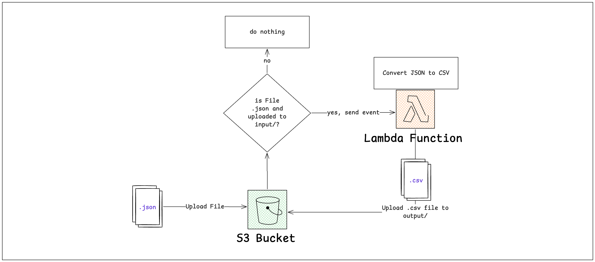

# JSON to CSV Converter

This project provides an AWS Lambda function that converts JSON files uploaded to an S3 bucket into CSV format and stores the resulting CSV files back in the same bucket.

## Table of Contents

- [JSON to CSV Converter](#json-to-csv-converter)
  - [Table of Contents](#table-of-contents)
  - [Overview](#overview)
  - [Tools \& Architecture](#tools--architecture)
  - [Prerequisites](#prerequisites)
  - [Local Development Setup](#local-development-setup)
  - [Local Testing](#local-testing)
  - [Deploying to AWS](#deploying-to-aws)
  - [Makefile Targets](#makefile-targets)
    - [Virtual Environment](#virtual-environment)
    - [Local Infrastructure](#local-infrastructure)
    - [AWS Infrastructure](#aws-infrastructure)

## Overview

The `json-converter` project automates the conversion of JSON files to CSV format using an AWS Lambda function. When a JSON file is uploaded to the `input/` path of the S3 bucket, the Lambda function is triggered, processing the file, and uploading the resulting CSV file to the `output/` path of the same bucket.



## Tools & Architecture

- **AWS S3**: Stores the input JSON files and the output CSV files.
- **AWS Lambda**: Processes the JSON files and converts them to CSV.
- **AWS IAM**: Manages permissions for the Lambda function to access S3 and CloudWatch logs.
- **Terraform**: Provisions the AWS resources.
- **LocalStack**: Simulates AWS services locally for development and testing.

## Prerequisites

1. [Python 3.12](https://www.python.org/downloads/) and [pip](https://pip.pypa.io/en/stable/installation/) installed
2. [Terraform](https://developer.hashicorp.com/terraform/tutorials/aws-get-started/install-cli) installed
3. [Docker](https://docs.docker.com/get-docker/) installed
   - For setting up the local development environment and testing the Lambda function.
4. [AWS CLI](https://docs.aws.amazon.com/cli/latest/userguide/install-cliv2.html) installed
5. Configure your AWS CLI with appropriate credentials:
   ```bash
   aws configure
   ```
6. Ensure you have the necessary permissions to create and manage AWS resources.

## Local Development Setup

Steps 1-3 are only required once to set up the local development environment. Steps 4-8 can be repeated as needed.

1. Create Python virtual environment:
   ```bash
   make venv-create
   ```
2. Activate the virtual environment:
   ```bash
   source venv/bin/activate
   ```
3. Install the required Python packages:
    ```bash
    make venv-install
    ```
4. Build & start Docker containers to simulate AWS services:
   ```bash
   make local-provision
   ```
   This will:
      - Package the Lambda function code into a zip file at `localstack/json-converter.zip`
      - Create a Docker network named `local-development`
      - Start LocalStack in a Docker container
      - Mount the Lambda zip file to the LocalStack container
      - Mount `localstack/s3-notif-config.json` to the LocalStack container
        - This file contains the S3 bucket notification configuration for the Lambda function
      - Mount `setup.sh` to the LocalStack container at `/etc/localstack/init/ready.d/` directory
        - This script will create the S3 bucket, Lambda function, and S3 event notification when LocalStack is ready to serve requests. (See [LocalStack's Initialization Hooks documentation](https://docs.localstack.cloud/references/init-hooks/) for more details)
5. Upload a JSON file to the `input/` folder of the S3 bucket to trigger the Lambda function:
   ```bash
   make local-upload-sample
   ```
6. Check the logs of the Lambda function to see the processing details:
   ```bash
   make local-follow-lambda
   ```
7. List the objects in the S3 bucket to see confirm the output CSV file:
   ```bash
    make local-show-s3
   ```
8. To destroy the local resources, run:
   ```bash
   make local-destroy
   ```
   This will stop and remove the LocalStack container and delete the Docker network.

## Local Testing
1. Follow step 4
2. Run the tests:
   ```bash
   make run-pytest
   ```
   This will run the tests in `tests/test.py`.

## Deploying to AWS
1. Initialize Terraform:
   ```bash
   terraform init
   ```
2. Plan the deployment:
   ```bash
   terraform plan
   ```
3. Apply the Terraform configuration:
   ```bash
   terraform apply
   ```
4. Confirm the deployment by typing `yes` when prompted.
5. Upload a JSON file to the `input/` folder of the S3 bucket.
6. The Lambda function will be triggered automatically, and the converted CSV file will be uploaded to the `output/` folder of the same bucket.
7. You can check the CloudWatch logs for the Lambda function to see the processing details and any errors that may occur during the conversion.
8. To clean up the resources created by Terraform, run:
   ```bash
   terraform destroy
   ```
    Confirm the destruction by typing `yes` when prompted.

## Makefile Targets

The following `make` commands are available for managing the project:

### Virtual Environment
- `make venv-create`: Create a Python virtual environment.
- `make venv-install`: Install dependencies in the virtual environment.
- `make venv-freeze`: Export dependencies to `requirements.txt`.

### Local Infrastructure
- `make local-provision`: Provision local resources via Docker Compose.
- `make local-destroy`: Destroy local resources via Docker Compose.
- `make local-upload-sample`: Upload sample data to the local S3 bucket.
- `make local-show-s3`: List objects in the local S3 bucket.
- `make local-follow-lambda`: Tail logs of the local Lambda function.
- `make run-pytest`: Run tests using `pytest`.

### AWS Infrastructure
- `make provision`: Provision AWS resources using Terraform.
- `make destroy`: Destroy AWS resources using Terraform.
- `make upload-sample`: Upload sample data to the AWS S3 bucket.
- `make full-start`: Provision AWS resources and upload sample data to trigger the Lambda function.
- `make delete-s3-bucket`: Delete the S3 bucket, including all objects.

Each target is designed to streamline development, testing, and deployment workflows.