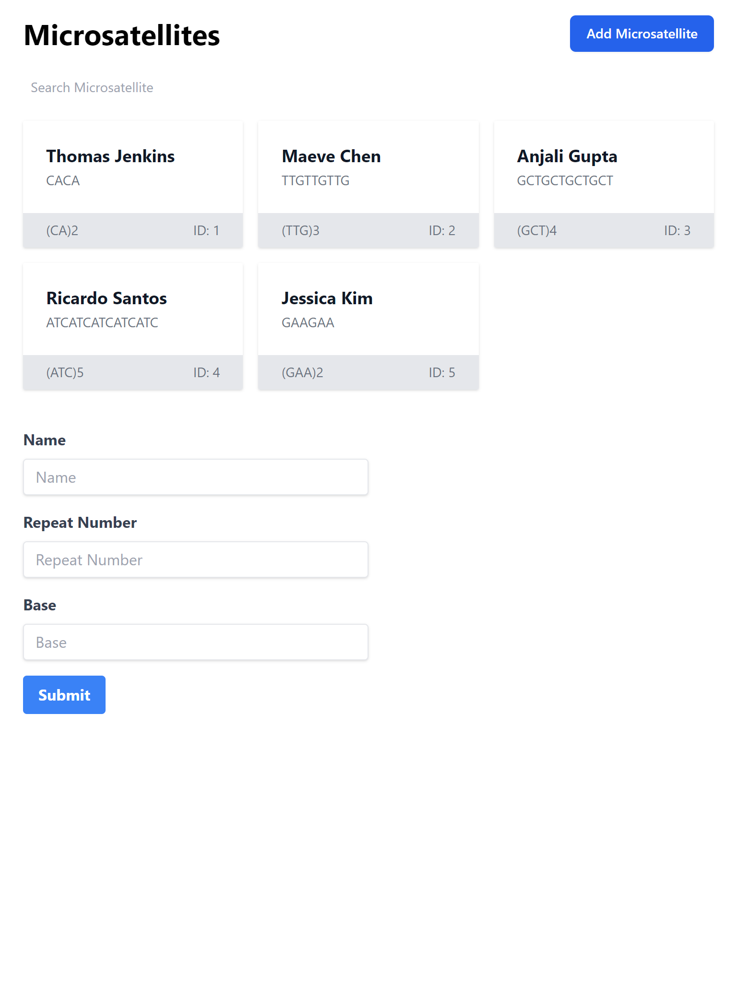
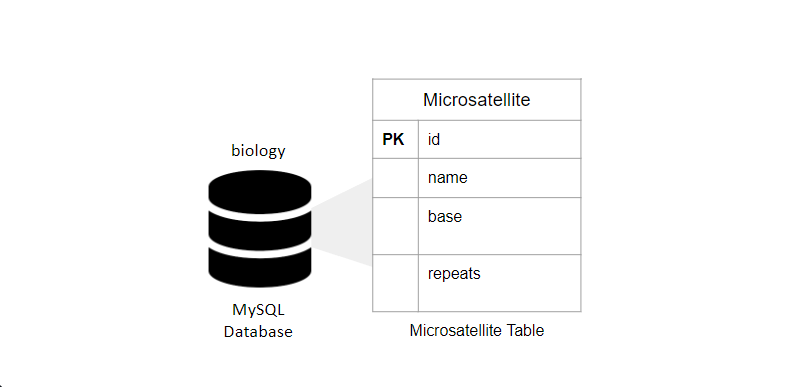
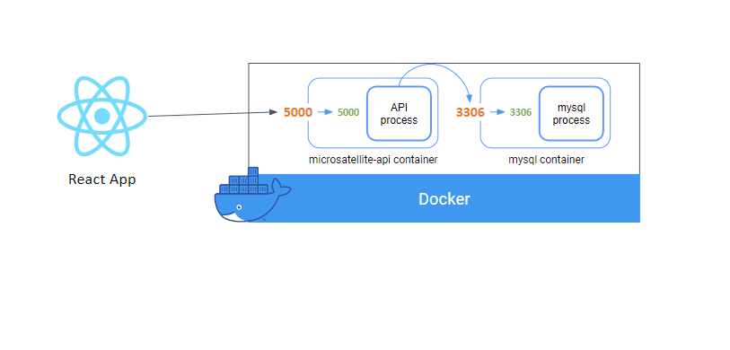

# Microsatellite
A full stack example application that allows users to see and presist microsatellite data.

## Table of Contents

- [Documentation](#documentation)
- [Prerequisites](#prerequisites)
- [Getting Started](#getting-started)

## Documentation
Technologies used:
- Python: API via Flask 
- MySQL: Database that holds the microsatellite data
- Docker: containerize the API and Database for local development

## Prerequisites 

- Install Python
    - via Chocolately for Windows
    - via Homebrew for Mac
- Install Docker
    - via Chocolately for Windows
    - via Homebrew for Mac
- (Optional) Install [Docker VSCode Extension](https://marketplace.visualstudio.com/items?itemName=ms-azuretools.vscode-docker). Helps with Syntax highlighting and autocompletion. 

## Getting Started

- Clone repo
- Run `make install` at the top level directory (at `microsatellite`) or just run `npm install` at the frontend project directory `microsatellite/frontend/microsatellite`  
- Run one of make targets:
 - `make full-start`: builds the API and MySQL database (backend) and React App (frontend)
 - `make start-backend`: builds the API and MySQL database
 - `make start-frontend`: builds the React App
